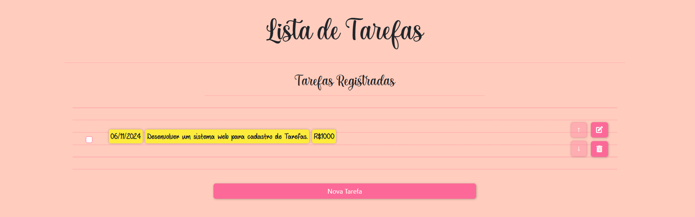
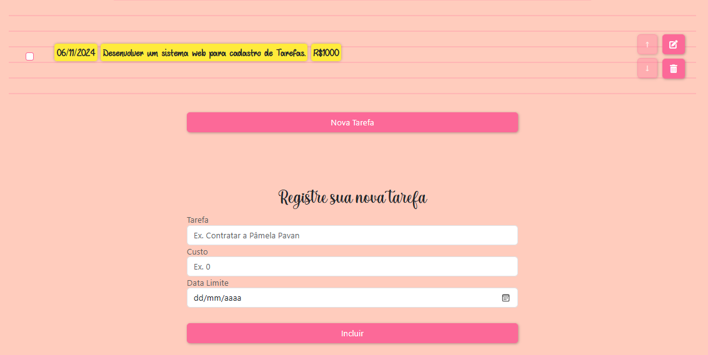

<h1 align="center"> LISTA DE TAREFAS</h1>


<h2 align="center"> <i>Sistema Web para Cadastro de Tarefas</i></h2>




## 📌 Índice
 
- [Introdução](#-Introdução)
- [Estrutura de pastas](#-Estrutura-de-pastas)
- [Como Executar o Projeto](#-Como-Executar-o-Projeto)
- [Funcionalidades](#-Funcionalidades)
- [Autor](#-Autor)

## Introdução
<p align="justify">
Este projeto é uma aplicação web interativa que oferece uma interface para cadastro de Tarefas.
</p>


## Estrutura de Pastas
```
project-root/
├── docs/
│   ├── README.md
│   └── requirements.txt
├── src/
│   ├── css/
│   ├── img/
│   ├── scripts/
│   ├── views/
│   ├── .gitignore
│   ├── app.js
│   └── .env.example
└── readme.md
```


## Como Executar o Projeto
Acesse: [Link - Sistema - Lista de Tarefas](https://listatarefa-pamela-pavan.up.railway.app/)

## Funcionalidades
1) <p align="justify">Na página principal do sistema possui campos de inserção para preencher com os valores de "Nome da Tarefa", "Custo da Tarefa" e data: "dd/mm/yyyy". Nesta parte é possível incluir registros selecionando o botão "Incluir";  
   Obs. Caso já exista uma tarefa com o novo nome escolhido, não será possível realizar a inclusão.  
3) Logo abaixo é listado em cards todos os registros mantidos na tabela(um abaixo do outro);  
4) Ao lado direito de cada registro são apresentados dois botões, um para executar a função de **editar** e outro para a função de **Excluir** registro;  
Obs. Quando a tarefa tiver Custo maior ou igual a R$1.000,00 deverá ser apresentada com fundo amarelo;  
Veja abaixo um exemplo: </p> 



4) <p align="justify"> Ao selecionar o botão de **Excluir** será apresentado uma mensagem de confirmação (Sim/Não) para a realização da
exclusão; </p>  

5) <p align="justify"> Ao selecionar o botão de **Editar**, será direcionado para uma página de edição. Nesta nova página, será possível alterar o Nome da Tarefa, o Custo e/ou a Data; </p>
Obs. Caso já exista uma tarefa com o novo nome escolhido, não será possível realizar a edição.  
<p align="justify">
Além disso, é possível reordenar as tarefas utilizando "drag-and-drop" e também utilizando as setas localizadas na lateral dos cards.  
</p>

## Autor

Pâmela Aliny Cleto Pavan  

[Linkedin](https://www.linkedin.com/in/pâmela-pavan-607693190/)

[Meu Repositório no Github](https://github.com/PamelaPavan)


